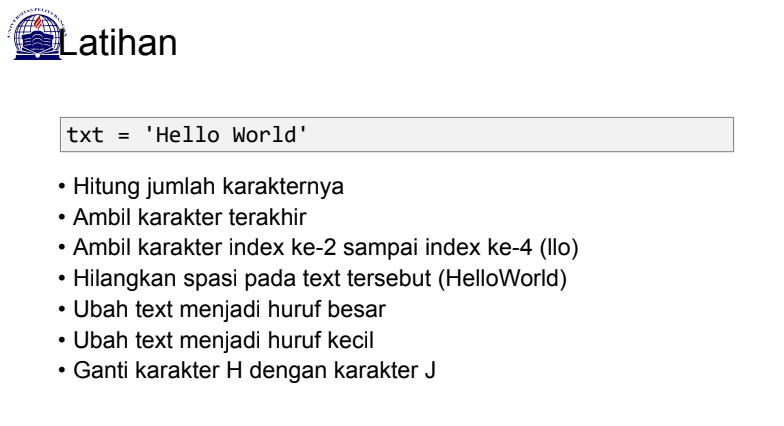
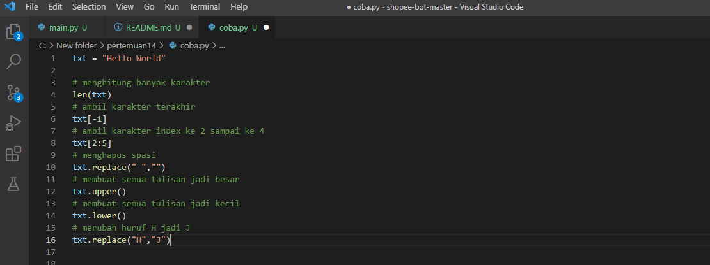
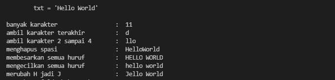
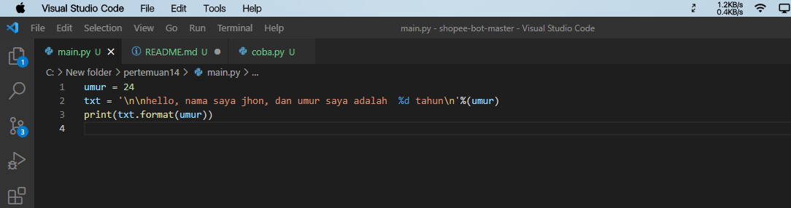
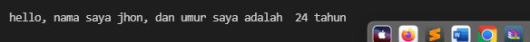

# **PERTEMUAN 14**
## SOAL

# latihan 1
> len(length) berfungs untuk menghitung jumlah karakter

> replace berfungsi untuk merubah karakter

> UPPER dan lower berfungsi untuk merubah semua karakter menjadi huruf besar maupun kecil

## visual studio code

## output

# latihan 2

> %s untuk memanggil string

> %d untuk memanggil desimal

> %f untuk memanggil float

## visual studio code

## output

